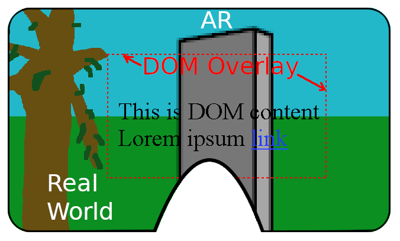

# **DOM Overlay Explainer**

## Introduction

The DOM overlays API provides a way to show DOM content such as text and control elements during a WebXR immersive AR session. This content is displayed as a transparent-background layer superimposed on the real-world scene and rendered WebGL content.

This API is an add-on feature for [WebXR](https://github.com/immersive-web/webxr/blob/master/explainer.md) and the [WebXR AR module](https://github.com/immersive-web/webxr-ar-module/blob/master/ar-module-explainer.md), and is only available in that context. Please refer to those two explainers and the corresponding standards for general background information. This explainer assumes familiarity with the WebXR API as used for immersive AR sessions.

### Usage scenarios

An AR experience may want to show messages to the user that are not tied to the 3D scene, for example instructions how to proceed ("Locate a flat surface that is at least 3’x3’").

The application may be using an AR view as part of a more complex experience, for example a model viewer that allows customizing an item's color or other properties.

A smartphone AR game could show onscreen buttons for game controls that are not tied to scene objects. This DOM overlay would also work on a head-mounted AR display using a controller ray for activating buttons, though an application may choose to use more direct controller inputs instead of the DOM overlay where available.  


### Goals

* Support showing DOM content during immersive AR/VR sessions to cover common use cases. This includes displaying explanatory text or HUD elements alongside an AR scene, and providing interactive elements such as buttons or sliders that affect the scene.

* Enable use of accessibility and internationalization features that would be difficult to handle correctly in a purely WebGL-based UI. The goal is to make it possible for user agents to leverage existing support for DOM accessibility features so that they can be used for DOM content displayed through this new API.

* Platforms that support multiple layers at the device compositor level could render the DOM overlay at higher quality than WebGL-drawn content. (See the [layers proposal](https://github.com/immersive-web/layers#why-layers-what-are-the-benefits) for more background on this.) 

### Non-goals

* The application does not get low-level control over placement of the DOM overlay rectangle; the placement of the overlay is intentionally left up to the user agent. The goal of the API is to enable common basic UI functionality across a variety of form factors, and it would be counterproductive for applications to make assumptions or attempt to fine-tune configurations in ways that only work on a specific class of devices.

* This API is not intended to support placing individual DOM elements at specific locations in the 3D scene. It does not address use cases such as placing labels directly on 3D objects or world features. Although an overlay could include elements that are styled with 3D CSS transforms or positioned in relation to scene content, with the application using DOM position attributes and similar techniques, the DOM Overlay API does not provide any direct support for such positioning. In addition, this is discouraged because it is unlikely to work across devices and form factors, especially between smartphones and headsets.

## Overview and feature summary

As a starting point, when DOM overlay is not in use, a WebXR `immersive-ar` sesssion displays a combination of real-world images and drawn WebGL content. Depending on the technology used, the real-world scene may be visible directly, for example on an AR headset using transparent optics, or may be a camera image for handheld smartphone AR or a camera-pass-through AR headset. The drawn WebGL content appears superimposed on the real-world scene, and the AR device tracks the user's position and orientation relative to the real world to make the drawn content appear consistently integrated.


The DOM overlays API adds an additional layer to this view. When it is active, the UA adds a transparent-background rectangle to the scene that displays the content of a DOM element and its child elements. The overlay element has a transparent background and is invisible when empty. Applications will typically place non-transparent child elements within the transparent overlay element to provide UI elements without blocking the entire viewport.

The exact appearance of the DOM overlay is platform dependent. Applications can use the [xrsession.domOverlayState.type](https://immersive-web.github.io/dom-overlays/#ref-for-dom-xrsession-domoverlaystate%E2%91%A2) attribute to distinguish the display modes.

On a phone used for handheld AR, a typical implementation would use a screen-sized rectangle for the DOM overlay, roughly equivalent to making that element fullscreen and setting its background transparent. This corresponds to the DOM overlay type `"screen"`:


When using an AR headset, the DOM overlay can appear as a rectangle floating in space, or appear attached to the headset similar to a helmet heads-up display. This corresponds to the DOM overlay types `"floating"` and `"head-locked"` respectively:



The DOM overlay content is interactive and supports DOM input events in addition to [WebXR input](https://immersive-web.github.io/webxr/#input). DOM input uses the touchscreen for handheld AR, or a handheld controller with a pointing ray for headset AR. A new `beforexrselect` event makes it possible to distinguish DOM input from XR input to avoid duplicate actions. Please see the [Input](#input) section below for details.

## Code example

Applications can use a DOM overlay by requesting the <code>["dom-overlay"](https://immersive-web.github.io/dom-overlays/#xrsessioninit)</code> feature as an optional or required feature in the WebXR `requestSession()` call, and supplying a DOM element as the `domOverlay.root` attribute in the session initialization dictionary.

In this example, the overlay element is a `<div>` that remains transparent, and the child `<header>` element is styled to appear at the top of the parent element with a translucent white background. The WebGL content drawn in the WebXR render loop is a simple semitransparent colored rectangle at the center of the viewport. Please refer to the [appendix](#appendix) for the self-contained source, the examples below use shortened snippets for clarity.

```html
  <body>
    <div id="overlay">
      <header>
        <summary>Barebones WebXR DOM Overlay</summary>
        <p>
          This sample demonstrates [...]
        </p>
        <div id="session-info" />
        <button id="xr-button" class="barebones-button" />
      </header>
    </div>
    [...]
```

```css
header {
  background-color: rgba(255, 255, 255, 0.90);
  position: relative;
  padding: 0.5em;
  left: 0px;
  [...]
}
```

```js
function onButtonClicked() {
  navigator.xr.requestSession(‘immersive-ar’,
   {
     optionalFeatures: ["dom-overlay"],
     domOverlay: {
       root: document.getElementById("overlay")
     }
   }
  ).then(onSessionStarted, onRequestSessionError);
}

function onSessionStarted(session) {
  document.getElementById("xr-button").innerHTML = "Exit AR";

  // Show which type of DOM Overlay got enabled (if any)
  document.getElementById("session-info").innerHTML =
    "DOM Overlay type: " + session.domOverlayState.type;
}

function onXRFrame(t, frame) {
  [...]
  // Update the clear color so that we can observe the color in the
  // headset changing over time. Use a scissor rectangle to keep the AR
  // scene visible.
  const width = session.renderState.baseLayer.framebufferWidth;
  const height = session.renderState.baseLayer.framebufferHeight;
  gl.enable(gl.SCISSOR_TEST);
  gl.scissor(width / 4, height / 4, width / 2, height / 2);
  let time = Date.now();
  gl.clearColor(
    Math.cos(time / 2000), Math.cos(time / 4000), Math.cos(time / 6000),
    0.5
  );
  gl.clear(gl.COLOR_BUFFER_BIT | gl.DEPTH_BUFFER_BIT);
}
```


During the session, the application can use WebXR WebGL rendering and WebXR controller input as usual.

The application can use normal DOM APIs to manipulate the content of the overlay element, and input is handled by the overlay DOM element as usual, including advanced input such as displaying a keyboard when tapping a text input field. As a simple example, a handheld AR application can use a DOM button for an "exit AR" action:

```js
let xrSession;
function onSessionStarted(session) {
  xrSession = session;
}

document.getElementById('exit-button').onclick = (ev) => {
  xrSession.end();
};
```

As a more advanced example, the DOM overlay can use DOM UI libraries such as [dat.gui](https://github.com/dataarts/dat.gui) to support interactions, for example dynamically adjusting the parameters of a [Lorenz attractor simulation](https://threejs.org/examples/#webxr_vr_lorenzattractor) while in AR. In this case, the UI elements appear as a child element of the fullscreen DOM overlay element:


## Input

On a handheld AR implementation, screen touches generate DOM events for the overlay element in the same way as they would if the overlay element were in regular 2D fullscreen mode.

For headset-based AR, The UA generates DOM input events based on XR controller actions, for example generating a `click` event at the location where the controller's pointer ray intersects the floating DOM content when the controller's primary trigger is used. This is intended to support a compatibility mode making content originally designed for handheld AR usable on a headset.

Low-level inputs that intersect the DOM overlay rectangle (including transparent areas) will be forwarded to the overlay's DOM element for processing according to the usual DOM event propagation model, using event x/y coordinates mapped to the DOM overlay rectangle. For example, screen touch or ray inputs are converted to DOM input events including `"click"` events (required) and optionally also pointerdown/pointermove/pointerup events if supported by the implementation.

### Input event handling for cross-origin content

If the DOM overlay element contains cross-origin content, for example an `<iframe>` element showing content from a different domain, the UA must block WebXR input events and related data such as controller poses while the user is interacting with that content to avoid information leaks. This is similar to the existing behavior for 2D web pages where the outer page is prevented from getting DOM pointermove events during mouse movement across a cross-domain embedded iframe element, just extended to also cover XR input sources in this situation.

Alternatively, the user agent may instead choose to make cross-domain content noninteractive or prevent it from being displayed.

### Input event deduplication

If a WebXR application uses a DOM overlay in conjunction with XR input, it is possible that a user action could be interpreted as both an interaction with a DOM element and as 3D input to the XR application. Specifically, WebXR's [input events](https://github.com/immersive-web/webxr/blob/master/input-explainer.md#input-events) (`"selectstart"`, `"selectend"`, and `"select"`) potentially duplicate DOM events when the user is interacting with a part of the scene covered by the DOM overlay, including transparent areas of the DOM overlay.

For screen-based phone AR, a screen touch generates a [transient XR input](https://immersive-web.github.io/webxr/#transient-input) that represents a ray being cast into the world which the application can use to trigger interactions such as placing a virtual object on the floor. The ambiguity arises when the touched screen location also shows a DOM element in the overlay. In this case, the user intent may be to use a world-interaction ray, or the intent may be to interact with a DOM UI element such as a button.

For headset-based AR where the DOM overlay is displayed as a floating rectangle along with a tracked motion controller, DOM UI interactions would typically be based on a ray emanating from the controller. If the same controller and primary trigger are also used for XR world interactions, the application needs to be able to disambiguate the input. For example, if the application uses the primary trigger to activate a sculpting tool, this should be temporarily suppressed if the user is trying to click on a button shown in the DOM overlay.

To help applications disambiguate, the user agent generates a <code>[beforexrselect](https://immersive-web.github.io/dom-overlays/#onbeforexrselect)</code> event on the clicked/touched DOM element. If the application calls `preventDefault()` on the event, the WebXR "select" events are suppressed for the duration of this interaction. The `beforexrselect` event bubbles, so the application can set an event handler on a container DOM element to prevent XR "select" events for all elements within this container.

```js
document.getElementById('ui-container').addEventListener('beforexrselect', (ev) => {
  ev.preventDefault();
});
```

A typical application would set such a `beforexrselect` handler for regions of the DOM UI that contain touchable UI elements. This often corresponds to opaque regions of the DOM overlay, but can be different. For example, noninteractive text regions could be treated as non-touchable (without a `beforexrselect` handler) so that they don't block the user from world interactions in those areas. Conversely, the application could set a `beforexrselect` handler on a transparent container element that's slightly larger than the UI elements in it, so that a slightly inaccurate touch that barely missed a button doesn't trigger an unexpected world interaction.

WebXR also supports non-event-based input. This includes controller poses, button/axis states, and transient XR input sources such as [Screen-based input](https://github.com/immersive-web/webxr/blob/master/input-explainer.md#screen) that creates 3D targeting rays based on 2D screen touch points. These inputs are not affected by DOM overlays and continue to be processed as usual. Applications are responsible for deduplicating these non-event inputs if they overlap with DOM events, though it's recommended to avoid UI designs that depend on this. There are ambiguous corner cases, for example pointer movement that starts on a DOM element and ends outside it.

## Implementation details

### Fullscreen API integration

A UA may internally use the [Fullscreen API](https://fullscreen.spec.whatwg.org/) to implement the DOM overlay mode, for example on a smartphone for handheld AR. To ensure consistency with other implementations that are not based on the Fullscreen API, there are some restrictions on this integration.
 
On session start, the specified DOM overlay root element automatically enters fullscreen mode, and remains in this mode for the duration of the session.  Using the Fullscreen API to change the fullscreen element is blocked by the UA while the session is active.

By design, there must always be an active fullscreened element while the session is active. Fully exiting fullscreen mode also ends the immersive-ar session. Conversely, ending the immersive-ar session automatically fully exits fullscreen mode to ensure that the user doesn’t end up in an indeterminate state. (The Fullscreen API allows this according to [4. UI](https://fullscreen.spec.whatwg.org/#ui): _“The user agent may end any fullscreen session without instruction from the end user or call to exitFullscreen() whenever the user agent deems it necessary.”_)

### Compositing

The DOM overlay consists of a single transparent-background rectangular DOM element and its children. It is composited on top of the immersive content by the user agent. The application can style the alpha color channel for elements to leave parts of the overlay transparent, but there is no depth-based occlusion in relation to the drawn WebGL content or real-world scene. The environment view and 3D elements in the scene are always covered by non-transparent DOM elements.

The display technology used affects how the overlay is composited. The application can use the DOM content's alpha channel to control visibility of DOM elements, and elements with a zero alpha value are always invisible, but technical limitations may result in content with non-zero alpha being invisible. Applications should check the existing <code>[XRSession.XREnvironmentBlendMode](https://immersive-web.github.io/webxr/#xrsession-interface)</code> attribute. A see-through AR headset typically uses the `"additive"` blend mode where black pixels appear transparent and dark colors on a transparent background are likely to be hard to see. Opaque black is only visible if the session uses `"alpha-blend"` blend mode.

The DOM overlay is restricted to a single rectangle at a fixed Z plane chosen by the user agent. There is no support for placing individual DOM elements at specific distances, or for showing different images to the left and right eyes for stereoscopic effects. This simplification is intended to make it easier to implement - the DOM content is conceptually rendered as a simple rectangular block of pixels that is then composed into a combined view.

### Display modes

The specific way that the DOM overlay content is displayed depends on the output device and user agent. In general, implementations have more freedom as the level of immersion increases, though there are requirements to help ensure consistent presentation that developers can rely on.

On a smartphone using the `"screen"` overlay type, the overlay covers the entire device screen as used for the camera and scene view, excluding system navigation areas if those are occluded or not touchable.

On a head-mounted AR display with a moderately-sized rectangular field of view (FoV), the overlay can use the `"head-locked"` overlay type to display a head-locked UI that fills the renderable viewport. (Seeing the real world around the overlay helps reduce discomfort that could otherwise be caused by head-locked content, and the FoV is small enough to keep eye movements needed to read content in a comfortable range.)

On a large-field-of-view AR headset, the overlay may use the `"floating"` overlay type to appear as a rectangle floating in space that's kept in front of the user, but isn't necessarily strictly head-locked in order to improve comfort. This rectangle may be smaller than the maximum FoV if necessary to ensure that the corners and edges remain easily visible. (The visible area can depend on the user's eye position and eye-to-lens distance, and extreme angles may be blurry for some headsets.) The user agent may also provide ways for the user to reposition or resize the floating rectangle.

## References & acknowledgements

This proposal is based on extended discussions in the `#immersive-web` community, and builds on proposals and suggestions by @ddorwin, @JohnPallett, @toji, and many others.

See also the [design sketch](http://docs/document/d/e/2PACX-1vRpXB5wX1R1QRzniysT5J1LhLQXAE5OMPX0kQiY-ozv8LsdsP22nf3mDyV6F8G92O_m0qAWMswLqOHT/pub) and [Chrome feature status entry](https://www.chromestatus.com/feature/6048666307526656).

## Appendix

### Full "barebones" example

The following self-contained "barebones" code is a lighly modified version of
https://immersive-web.github.io/webxr-samples/ar-barebones.html from the WebXR samples repository:

```html
<!DOCTYPE html>
<html>
  <body>
    <div id="overlay">
      <header>
        <details open>
          <summary>Barebones WebXR DOM Overlay</summary>
          <p>
            This sample demonstrates extremely simple use of an
            "immersive-ar" session with no library dependencies, with an
            optional DOM overlay. It doesn't render anything exciting, just
            draws a rectangle with a slowly changing color to prove it's
            working.
            <a class="back" href="./index.html">Back</a>
          </p>
          <div id="session-info"></div>
          <div id="warning-zone"></div>
          <button id="xr-button" class="barebones-button" disabled>
            XR not found
          </button>
        </details>
      </header>
    </div>
    <main style="text-align: center;">
      <p>Body content</p>
    </main>
    <script type="module">
      // XR globals.
      let xrButton = document.getElementById("xr-button");
      let xrSession = null;
      let xrRefSpace = null;

      // WebGL scene globals.
      let gl = null;

      function checkSupportedState() {
        navigator.xr.isSessionSupported("immersive-ar").then(supported => {
          if (supported) {
            xrButton.innerHTML = "Enter AR";
          } else {
            xrButton.innerHTML = "AR not found";
          }

          xrButton.disabled = !supported;
        });
      }

      function initXR() {
        if (!window.isSecureContext) {
          let message = "WebXR unavailable due to insecure context";
          document.getElementById("warning-zone").innerText = message;
        }

        if (navigator.xr) {
          xrButton.addEventListener("click", onButtonClicked);
          navigator.xr.addEventListener("devicechange", checkSupportedState);
          checkSupportedState();
        }
      }

      function onButtonClicked() {
        if (!xrSession) {
          // Ask for an optional DOM Overlay, see https://immersive-web.github.io/dom-overlays/
          navigator.xr
            .requestSession("immersive-ar", {
              optionalFeatures: ["dom-overlay"],
              domOverlay: { root: document.getElementById("overlay") }
            })
            .then(onSessionStarted, onRequestSessionError);
        } else {
          xrSession.end();
        }
      }

      function onSessionStarted(session) {
        xrSession = session;
        xrButton.innerHTML = "Exit AR";

        // Show which type of DOM Overlay got enabled (if any)
        document.getElementById("session-info").innerHTML =
          "DOM Overlay type: " + session.domOverlayState.type;

        session.addEventListener("end", onSessionEnded);
        let canvas = document.createElement("canvas");
        gl = canvas.getContext("webgl", {
          xrCompatible: true
        });
        session.updateRenderState({ baseLayer: new XRWebGLLayer(session, gl) });
        session.requestReferenceSpace("local").then(refSpace => {
          xrRefSpace = refSpace;
          session.requestAnimationFrame(onXRFrame);
        });
      }

      function onRequestSessionError(ex) {
        alert("Failed to start immersive AR session.");
        console.error(ex.message);
      }

      function onEndSession(session) {
        session.end();
      }

      function onSessionEnded(event) {
        xrSession = null;
        xrButton.innerHTML = "Enter AR";
        document.getElementById("session-info").innerHTML = "";
        gl = null;
      }

      function onXRFrame(t, frame) {
        let session = frame.session;
        session.requestAnimationFrame(onXRFrame);
        let pose = frame.getViewerPose(xrRefSpace);

        if (pose) {
          gl.bindFramebuffer(
            gl.FRAMEBUFFER,
            session.renderState.baseLayer.framebuffer
          );

          // Update the clear color so that we can observe the color in the
          // headset changing over time. Use a scissor rectangle to keep the AR
          // scene visible.
          const width = session.renderState.baseLayer.framebufferWidth;
          const height = session.renderState.baseLayer.framebufferHeight;
          gl.enable(gl.SCISSOR_TEST);
          gl.scissor(width / 4, height / 4, width / 2, height / 2);
          let time = Date.now();
          gl.clearColor(
            Math.cos(time / 2000),
            Math.cos(time / 4000),
            Math.cos(time / 6000),
            0.5
          );
          gl.clear(gl.COLOR_BUFFER_BIT | gl.DEPTH_BUFFER_BIT);
        }
      }

      initXR();
    </script>
  </body>
</html>
```
